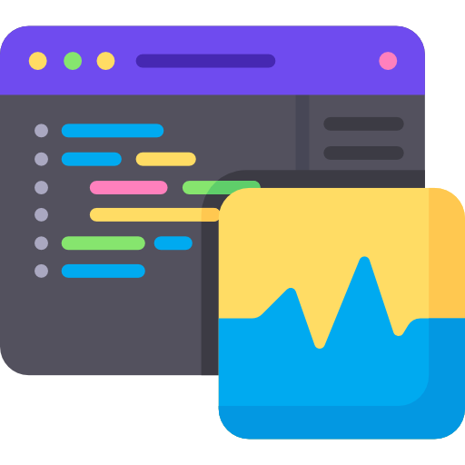

#  Немного о себе

### _Я — QA Engineer_ 

Меня зовут Марсель, мне 22 года. Я имею 1 год и 6 месяцев опыта в автоматизации тестирования UI/API на Java. В свободное время изучаю новые подходы и инструменты в автоматизации на YouTube и Хабре. Люблю Stepik там много интересных курсов по автоматизации и Java. Также был опыт разработки на бэкенде.

В данное время работаю в 

 

##  Мои проекты

    
    
    
    
    

    

##  Стек технологий

    
    
    
    
    
    
    
    
    
     
    
    
    

 

##  Статистика GitHub

    &nbsp;
    &nbsp;
    
    

##  Контакты

    &nbsp;

 

    

    

